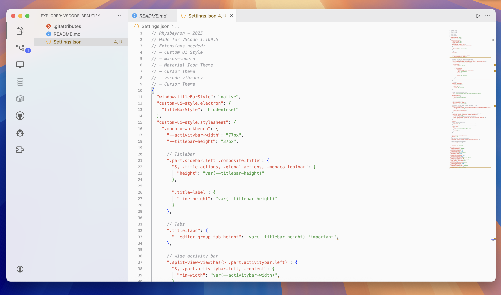

<div align="center">


# VSCode-Beautify
A MacOS styled VSCode config for native-like visuals and inline title bar build for, and working on, the latest version of vscode.

| Description | Preview |
|-------------|---------|
| **Dark mode:** |  |
| **Light mode:** |  |

</div>

## How to install

### Required Extensions
Before importing the settings, you'll need to install these VS Code extensions:

1. **Custom UI Style** - Enables custom CSS styling
2. **macos-modern** - Modern macOS-style icons  
3. **Material Icon Theme** - File and folder icons
4. **Cursor Theme** - Custom cursor styling
5. **vscode-vibrancy** - Adds transparency and vibrancy effects
6. **Atom One Light Theme** - Light color theme for VS Code

You can install these extensions either:
- Through the VS Code Extensions marketplace (search for each extension name)
- Or via command line:
```bash
code --install-extension be5invis.vscode-custom-css
code --install-extension davidbwaters.macos-modern-theme
code --install-extension PKief.material-icon-theme
code --install-extension iCrawl.vscode-tailwindcss
code --install-extension eyhn.vscode-vibrancy
code --install-extension akamud.vscode-theme-onelight
```

### Import Settings

1. **Open VS Code Settings:**
   - Press `Cmd + ,` (macOS) or `Ctrl + ,` (Windows/Linux)
   - Or go to `Code > Preferences > Settings`

2. **Access settings.json:**
   - Click the "Open Settings (JSON)" icon in the top-right corner of the Settings tab
   - Or use `Cmd + Shift + P` and search for "Preferences: Open Settings (JSON)"

3. **Import the configuration:**
   - Copy the contents of `Settings.json` from this repository
   - Replace your existing settings.json content with the copied configuration
   - Save the file (`Cmd + S`)

4. **Restart VS Code:**
   - Close and reopen VS Code for all changes to take effect
   - Some styling changes may require a complete restart

## Feel free to use, modify, whatever. I dont care :)